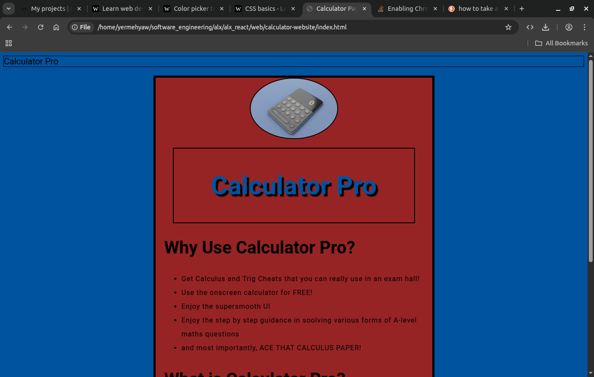
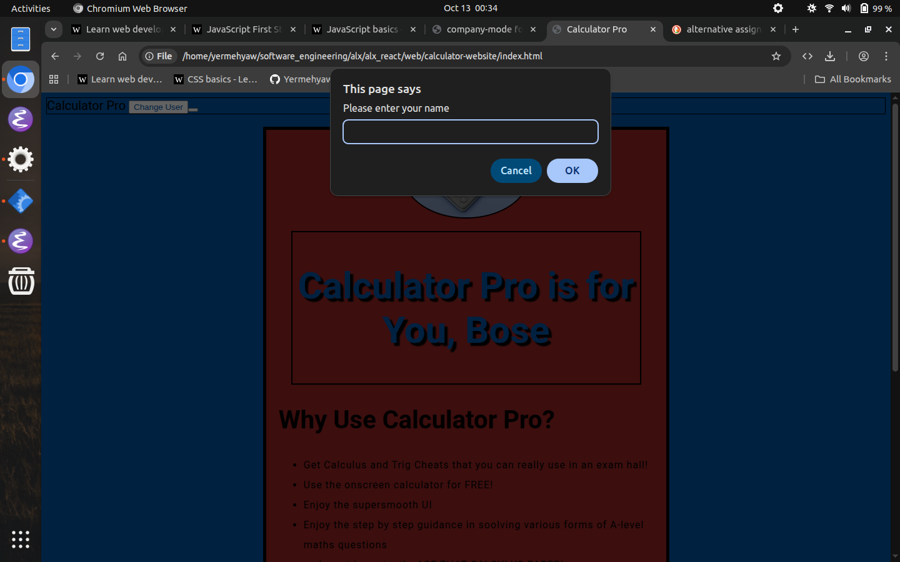
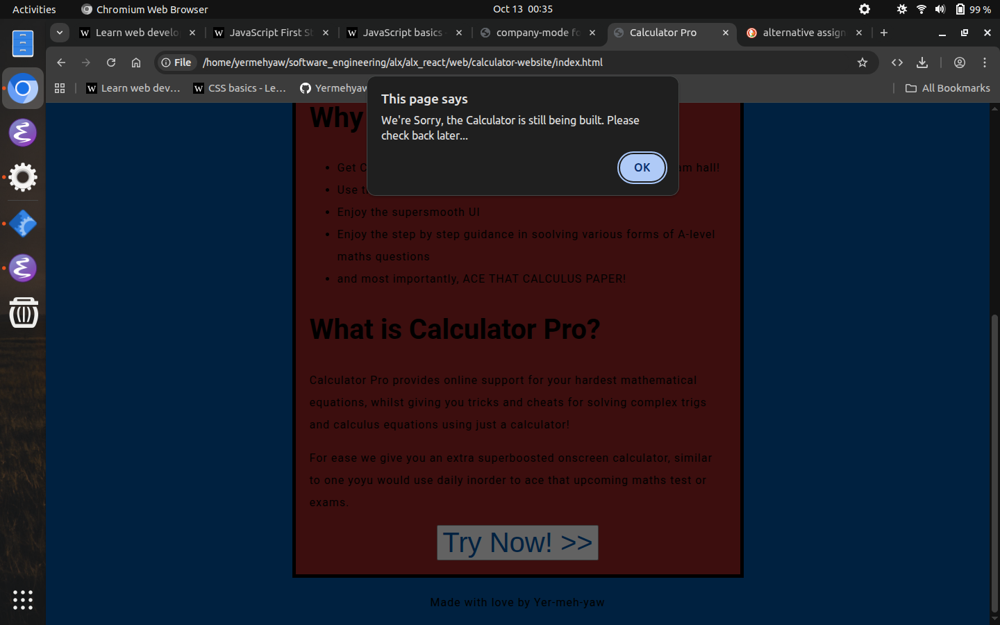

# alx_react
Learning html, css and react by creating a basic calculator webpage, fufiling alx tasks, building on freecodecamp and trying out other stuff.

## Screenshots

v1 calculator pro (html+css only)

v1.1 calculator pro (html+css+vanillajs)

